# Urban Zone Classification from Open Data

**Course:** DEML — Digital Tools for Data Encoding and Machine Learning
**Program:** MaCAD26, IAAC Barcelona
**Last updated:** May 24, 2026

---

## 1. Research Question

> Can observable urban characteristics — amenity density, building typology, road networks, commercial activity — extracted from OpenStreetMap predict official land use **without zoning data**?

### Why This Matters

Official zoning data is expensive, proprietary, or simply nonexistent in most cities worldwide. OpenStreetMap (OSM), on the other hand, is open, collaborative, and global. If a model trained on property data from well-documented cities (NYC, Philadelphia, Chicago) can generalize to cities with only OSM (Washington DC, San Francisco, Los Angeles), we'd have a **universal tool for urban analysis**.

### Dual Application

**1. Universal prediction:** Train with cities that have property data as Ground Truth, predict land use in cities with only OSM. This validates whether OSM signals alone are sufficient to classify urban zones without local knowledge.

**2. Urban transformation detection:** Compare model predictions against existing official zoning to identify **zones in transition** — areas where observable behavior (commercial activity, building typology) no longer matches the official classification. These discrepancies are potential indicators of gentrification, industrial reconversion, or mixed-use expansion.

### Technical Pipeline

```
config.py (6 cities) --> run_pipeline.py --> [per city: grid.py --> features.py --> overpass.py]
--> csv/all_cities_combined.csv --> ml_analysis.ipynb (EDA + LR/XGB/RF/SVC/ANN + clustering)
```

---

## 2. Dataset

### 2.1 City Selection

Six cities divided into two groups based on property data availability. This division is the backbone of the transfer learning experiment (Section 5.3).

| City | Country | Mode | Property Dataset | Reason for Inclusion |
|---|---|---|---|---|
| **New York City** | USA | `property` | PLUTO 25v4 (~900K lots) | Most complete dataset, primary baseline |
| **Philadelphia** | USA | `property` | OPA (Office of Property Assessment) | Mid-size American city, contrast with NYC |
| **Chicago** | USA | `hybrid` | Cook County Assessor | Grid-layout metropolis, different urban morphology |
| **Washington DC** | USA | `osm` | — (OSM only) | Federal capital, high density of institutional services |
| **San Francisco** | USA | `osm` | — (OSM only) | Compact city with distinct neighborhoods |
| **Los Angeles** | USA | `osm` | — (OSM only) | Sprawling city, extreme morphological contrast |

### 2.2 Class Distribution

The unit of analysis is a **150m x 150m grid cell**. Each cell receives a class label (`zone_type`) derived from property data (Group A) or OSM landuse tags (Group B).

| City | Group | Total Cells | Residential | Commercial | Other | Res:Com Ratio |
|---|---|---|---|---|---|---|
| **NYC (Manhattan)** | A | 1,810 | 1,348 | 283 | 179 | 4.8 : 1 |
| **Philadelphia** | A | 9,979 | 8,322 | 945 | 712 | 8.8 : 1 |
| **Chicago** | A | 12,057 | 10,574 | 1,343 | 140 | 7.9 : 1 |
| **Washington DC** | B | 5,017 | 3,994 | 279 | 744 | 14.3 : 1 |
| **San Francisco** | B | 3,876 | 2,832 | 463 | 581 | 6.1 : 1 |
| **Los Angeles** | B | 27,539 | 20,904 | 2,104 | 4,531 | 9.9 : 1 |
| **TOTAL** | — | **60,278** | 47,974 | 5,417 | 6,887 | 8.9 : 1 |

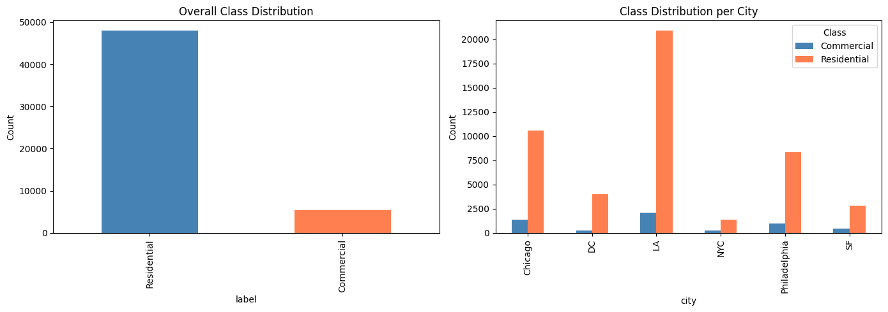

All models use `class_weight="balanced"` to compensate for class imbalance.

---

## 3. Feature Engineering

Each feature captures a different aspect of the urban character of a 150m x 150m cell.

### 3.1 Iteration 1: 10 Original Features (Baseline — NYC only)

| Feature | Source | Urban Hypothesis |
|---|---|---|
| `amenity_density` | OSM | Commercial zones have more amenities |
| `amenity_ratio_food_drink` | OSM | High ratio = active service zone |
| `avg_floors` | PLUTO | Taller buildings = higher intensity of use |
| `avg_yearbuilt` | PLUTO | Older buildings may indicate historic commercial cores |
| `building_count` | PLUTO | Building density |
| `total_bldg_area` | PLUTO | Total built mass |
| `landuse_entropy` | PLUTO | High entropy = mixed uses = transition zone |
| `tourism_density` | OSM | Tourist zones tend to be commercial |
| `shop_density_km2` | OSM | Direct indicator of commercial activity |
| `brand_ratio` | OSM | Presence of national/international franchises |

**Baseline Results (NYC only):**

| Model | Accuracy |
|---|---|
| Logistic Regression | 82.9% |
| XGBoost | 89.9% |
| Random Forest | 90.2% |
| **SVC Polynomial** | **90.5%** |

### 3.2 Features Removed

Based on the ablation study from the Baseline:

- **`tourism_density` — REMOVED.** Model accuracy *improves* when this feature is removed. Hotels and tourist attractions are distributed too uniformly across Manhattan to be discriminating at 150m scale.
- **`brand_ratio` — REMOVED.** Importance below 5% across all models. Franchise presence is too noisy — a CVS pharmacy can be in a residential neighborhood just as easily as in a commercial corridor.

### 3.3 Features Added (Iteration 2)

| New Feature | Source | Hypothesis |
|---|---|---|
| `office_density` | OSM | Direct indicator of daytime corporate activity |
| `road_density_primary` | OSM | Commercial zones sit on major arterial roads |
| `transit_stop_density` | OSM | High-frequency transit concentrates in commercial areas |
| `intersection_density` | OSM | Denser street grids = commercial urban cores |
| `nightlife_density` | OSM | Nightlife is a strong marker of commercial/mixed zones |

### 3.4 Iteration 2: 13 Optimized Features

8 retained + 5 new - 2 removed = **13 features**.

**Feature statistics across 60,278 cells (6 cities):**

| Feature | Mean | Std | %NaN | Source |
|---|---|---|---|---|
| `amenity_density` | 179.0 | 777.9 | 0% | OSM |
| `amenity_ratio_food_drink` | 0.04 | 0.14 | 0% | OSM |
| `avg_floors` | 2.9 | 3.3 | 73.9% | Property |
| `avg_yearbuilt` | 1940.8 | 24.8 | 80.6% | Property |
| `building_count` | 44.7 | 43.2 | 67.4% | Property |
| `total_bldg_area` | 164,058 | 338,985 | 67.4% | Property |
| `landuse_entropy` | 0.59 | 0.84 | 0% | Property/OSM |
| `shop_density_km2` | 20.7 | 86.7 | 0% | OSM |
| `office_density` | 4.9 | 26.1 | 0% | OSM |
| `road_density_primary` | 2.7 | 7.3 | 0% | OSM |
| `transit_stop_density` | 26.9 | 72.1 | 0% | OSM |
| `intersection_density` | 52.3 | 96.7 | 0% | OSM |
| `nightlife_density` | 3.0 | 18.7 | 0% | OSM |

Property-derived features have high NaN rates because OSM-only cities cannot obtain complete building geometry from the Overpass API (server memory limits for large bounding boxes). NaN values are imputed as 0 during ML training.

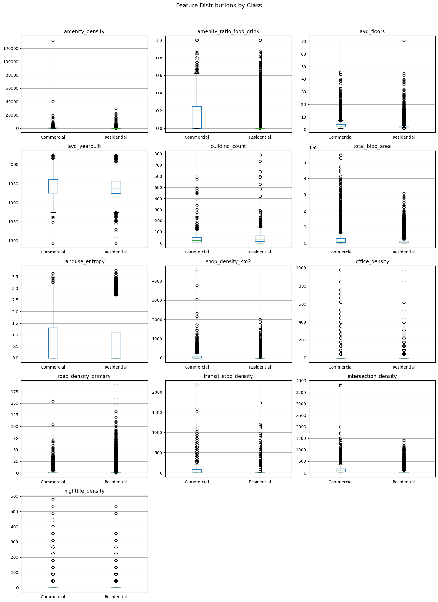

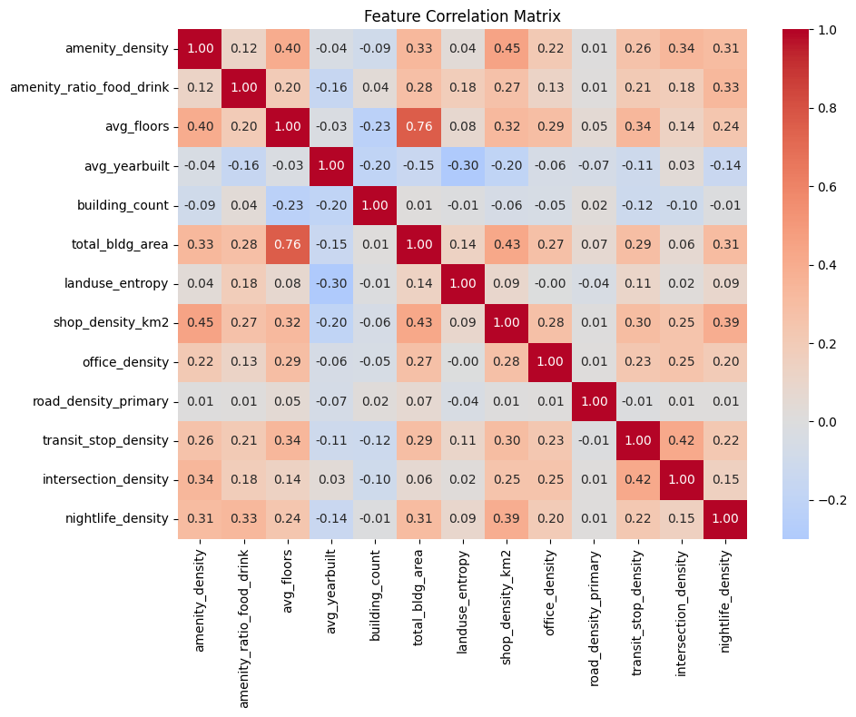

---

## 4. Classification Categories

### 4.1 Mixed-Use Handling

A critical design decision: what to do with **Mixed-Use** zones. In NYC/PLUTO, ~15-20% of cells have a combination of residential and commercial use that doesn't fit cleanly into either class.

Two approaches were compared:

- **Option A — Binary classification (exclude Mixed-Use):** Cleaner classes, better accuracy, but cannot predict mixed zones.
- **Option B — 3-class classification (include Mixed-Use):** More complete, captures urban reality, but Mixed-Use is inherently ambiguous and harder to predict.

### 4.2 Binary vs 3-Class Results

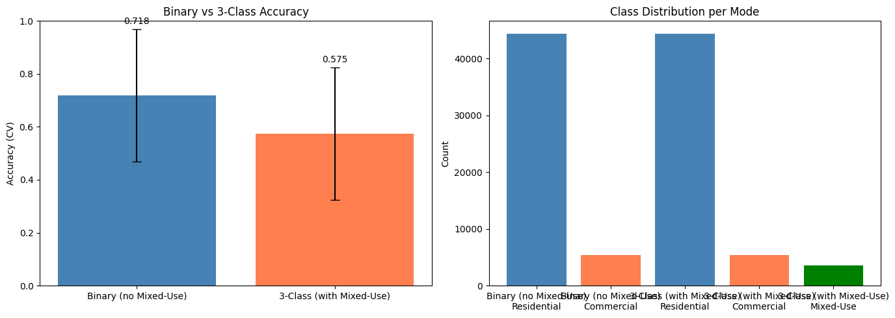

| Configuration | Samples | Classes | Accuracy (CV) | Std |
|---|---|---|---|---|
| **Binary (no Mixed-Use)** | **49,848** | **2** | **71.8%** | **+/-25.0%** |
| 3-Class (with Mixed-Use) | 53,391 | 3 | 57.5% | +/-25.0% |

**Difference: +14.3 percentage points in favor of Binary.** Mixed-Use characteristics overlap significantly with both Residential and Commercial, making it inherently ambiguous. For universal prediction, Binary is clearly superior.

---

## 5. Models & Results

### 5.1 Iteration 1: NYC Baseline (10 features)

| Model | Accuracy | Notes |
|---|---|---|
| Logistic Regression | 82.9% | Linear model — suggests partial linear separability |
| XGBoost | 89.9% | Notable improvement over LR — nonlinearities in data |
| Random Forest | 90.2% | Comparable to XGB, more stable in cross-validation |
| **SVC Polynomial** | **90.5%** | **Best baseline model** — polynomial kernel captures feature interactions |

### 5.2 Iteration 2: 6 Cities, 13 Features

Combined training with 53,391 cells from 6 cities (80/20 stratified split). Binary classification: Commercial vs Residential.

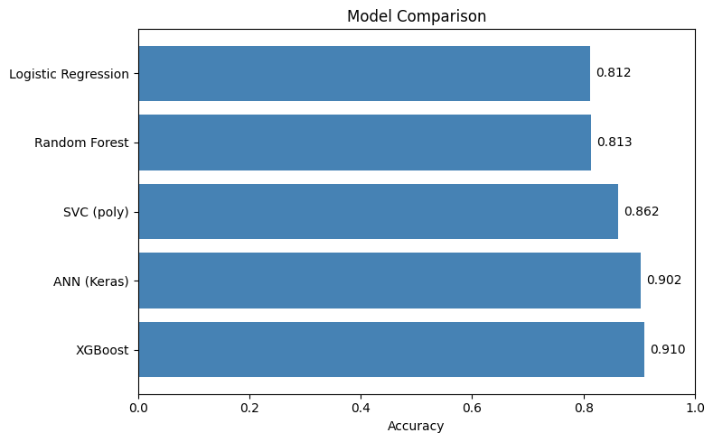

**Global results (combined test set):**

| Model | Accuracy | F1 Commercial | F1 Residential |
|---|---|---|---|
| **XGBoost** | **90.98%** | **0.37** | **0.95** |
| ANN (Keras) | 90.20% | 0.13 | 0.95 |
| SVC (poly) | 86.21% | 0.41 | 0.92 |
| Random Forest | 81.28% | 0.44 | 0.89 |
| Logistic Regression | 81.23% | 0.42 | 0.89 |

**Key observations:**
- XGBoost leads by a wide margin (+4.8% over SVC, +9.7% over RF)
- In the Baseline (Manhattan only), SVC poly was the best. With 6 heterogeneous cities, XGBoost dominates — its ability to handle heterogeneous data and imbalanced classes shines
- ANN achieves similar accuracy to XGBoost but with very low Commercial F1 (0.13) — it predicts almost everything as Residential

#### Individual Model Results

| | |
|---|---|
| 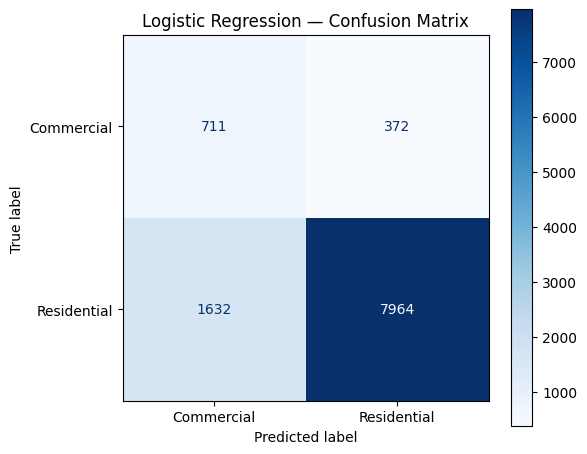 | 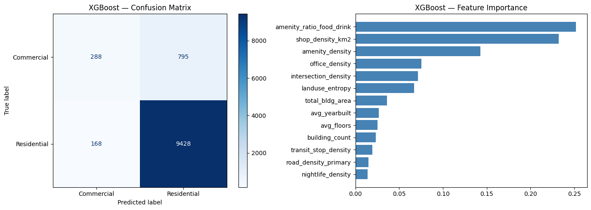 |
| 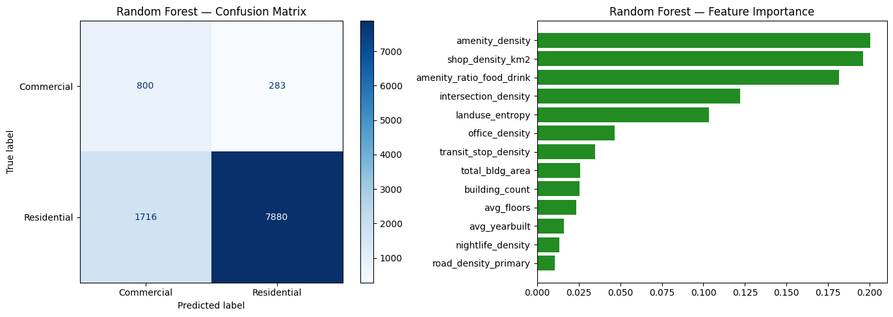 | 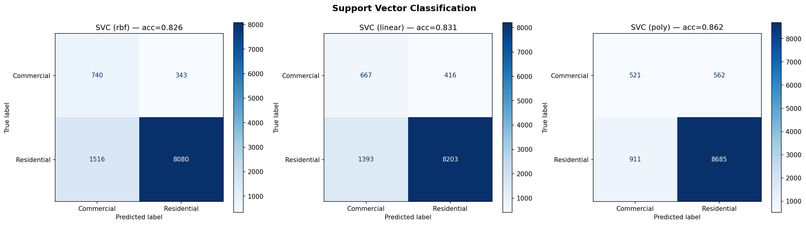 |
| 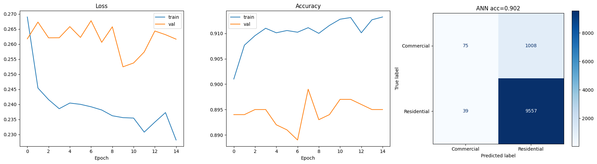 | |

#### Hyperparameter Tuning

- RF best params: `max_depth=None, min_samples_leaf=1, n_estimators=200` — CV accuracy 88.4%
- SVC best params: `C=0.1, gamma=scale, kernel=poly` — CV accuracy 88.2%

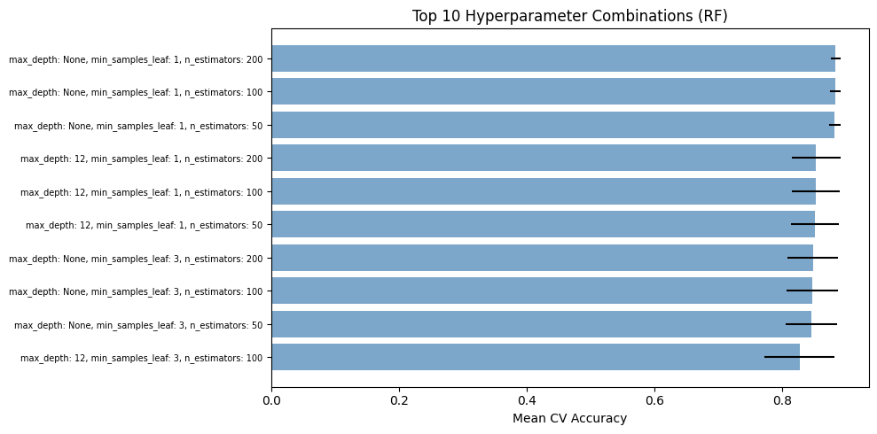

### 5.3 Ablation Study

The ablation study measures each feature's impact by removing it and measuring accuracy change.

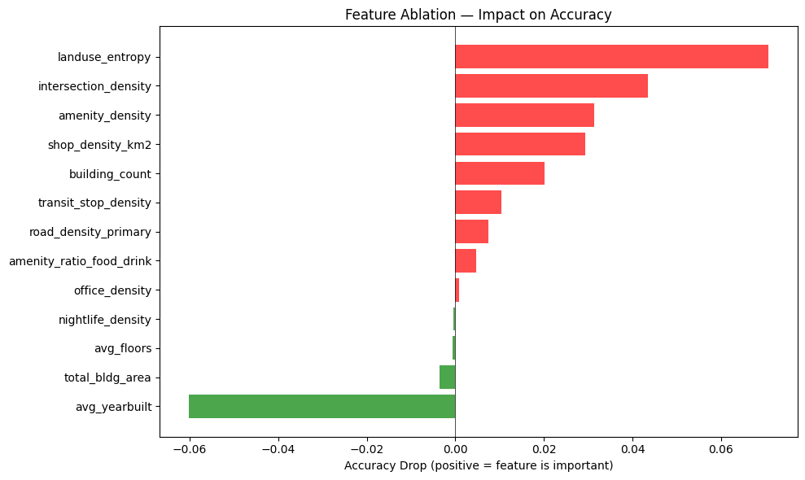

| Feature Removed | Accuracy Without It | Impact |
|---|---|---|
| landuse_entropy | 74.68% | **-7.08%** (most important) |
| intersection_density | 77.41% | -4.34% |
| amenity_density | 78.63% | -3.13% |
| shop_density_km2 | 78.82% | -2.93% |
| building_count | 79.74% | -2.01% |
| transit_stop_density | 80.72% | -1.03% |
| road_density_primary | 81.01% | -0.74% |
| amenity_ratio_food_drink | 81.28% | -0.47% |
| office_density | 81.66% | -0.09% |
| nightlife_density | 81.79% | +0.04% (noise) |
| total_bldg_area | 82.12% | +0.37% (noise) |
| avg_floors | 81.82% | +0.07% (noise) |
| avg_yearbuilt | 87.78% | **+6.02%** (harms the model) |

**Key finding:** `avg_yearbuilt` has a strong *negative* impact — accuracy **improves by 6%** when removed. This is because `avg_yearbuilt` has 80.6% NaN in the dataset (only NYC, Philadelphia, and Chicago partially have it), and values imputed as 0 for OSM-only cities create a spurious signal.

### 5.4 Transfer Learning: Ground Truth to OSM-Only

This is the **central experiment** of the project. The model is trained **exclusively** on the 3 Group A cities (NYC, Philadelphia, Chicago) and evaluated on the 3 Group B cities (DC, SF, LA), where ground truth is also OSM-derived.

**The question it answers: Are the OSM signals that distinguish Commercial from Residential in NYC universal or NYC-specific?**

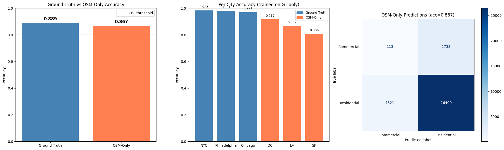

| Trained On | Evaluated On | Accuracy | Cells |
|---|---|---|---|
| NYC + PHL + CHI | **GT Test Set** | **88.9%** | 22,815 |
| NYC + PHL + CHI | DC | 91.7% | 4,273 |
| NYC + PHL + CHI | LA | 86.7% | 23,008 |
| NYC + PHL + CHI | SF | 80.6% | 3,295 |
| NYC + PHL + CHI | **OSM-Only Average** | **86.7%** | 30,576 |

**Per-city accuracy:**

| City | Accuracy | Cells | Group |
|---|---|---|---|
| NYC | 98.3% | 1,631 | Ground Truth |
| Philadelphia | 98.1% | 9,267 | Ground Truth |
| Chicago | 97.1% | 11,917 | Ground Truth |
| DC | 91.7% | 4,273 | OSM-Only |
| LA | 86.7% | 23,008 | OSM-Only |
| SF | 80.6% | 3,295 | OSM-Only |

### Answer to the Research Question

> **OSM-Only accuracy = 86.7% (>80%) — OSM data is sufficient to predict urban zones.**
>
> The delta between Ground Truth (88.9%) and OSM-Only (86.7%) is only **2.2 percentage points** — remarkably low. Urban signals from OSM (amenity density, land use entropy, intersection density, shops, offices, transit) generalize well across cities with distinct morphologies.

**Differences among OSM-Only cities:**
- **DC (91.7%):** The most compact and urbanly dense of the three — morphology similar to training cities
- **LA (86.7%):** Despite being sprawling, achieves good accuracy — land use signal is strong
- **SF (80.6%):** Lowest but still acceptable — possibly due to missing building data in OSM (0 buildings found by Overpass) and lower road coverage (0 road ways)

---

## 6. Exploratory Data Analysis

### Dimensionality Reduction & Clustering

| | |
|---|---|
| 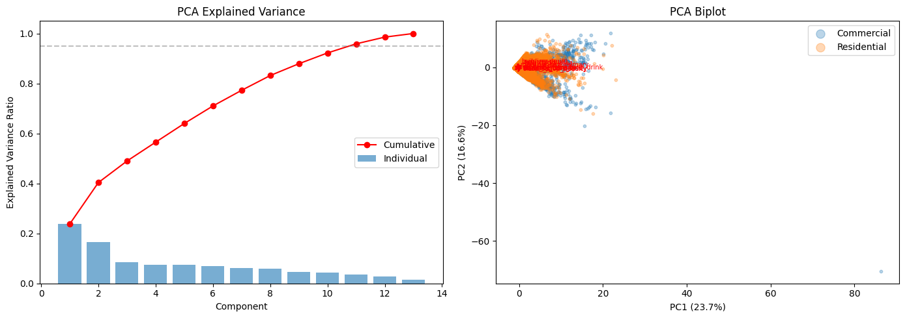 | 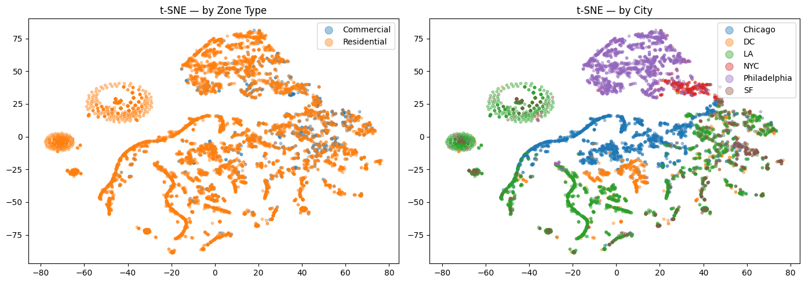 |
| 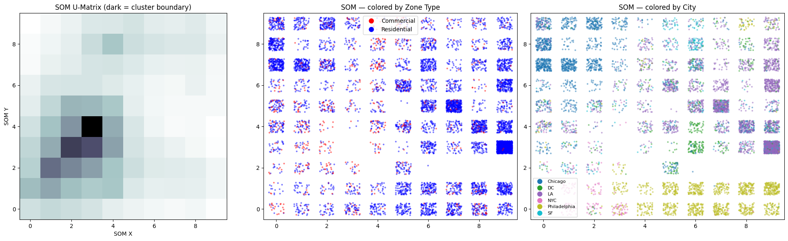 | 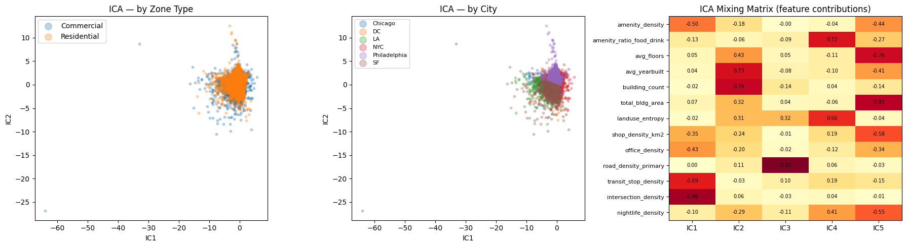 |

### K-Means Clustering

K-Means found **k=2 as the optimal number of clusters** (by silhouette score), aligning with the binary classification. The Adjusted Rand Index between clusters and actual zones is low (0.015), indicating that unsupervised clustering based on features alone captures different structure than the official zoning labels.

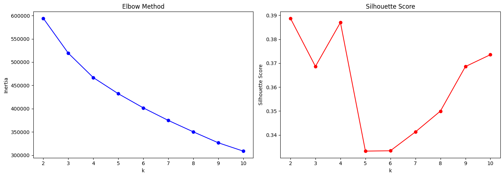

### Encoding Comparison

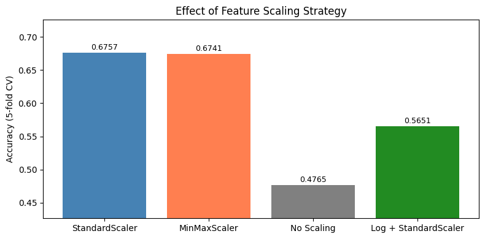

### Feature Means by Zone Type

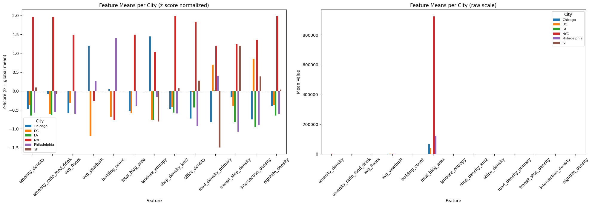

---

## 7. Geographic Visualization

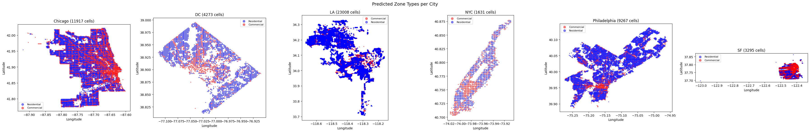

---

## 8. Key Decisions

Every decision in this project is backed by evidence — this is what distinguishes experiments from trial-and-error.

1. **6 cities divided into 2 groups** (3 with property data + 3 OSM-only) to structure a transfer learning experiment: can a model trained with precise Ground Truth generalize to cities without it?

2. **Regular 150m x 150m grid** instead of census tracts or neighborhood polygons. Census tracts are irregular, vary in size across cities, and don't exist everywhere. A regular grid is comparable across cities, reproducible, and geometrically neutral.

3. **Removed `tourism_density`** because the ablation study showed accuracy *improves* when it's removed — direct evidence of noise.

4. **Removed `brand_ratio`** due to consistently low importance (<5%) across all models.

5. **Added 5 new features** (office, road, transit, intersection, nightlife density) based on urban morphology hypotheses. Some were previously tested at census tract scale and showed no signal — re-tested here because the 150m scale and 6-city diversity may change the outcome.

6. **Compared binary vs 3-class** classification for Mixed-Use handling. This isn't a technical detail — it's a decision about what type of question we want to answer.

7. **`class_weight="balanced"` in all models** because the class imbalance (8.9:1 overall) would allow a naive model predicting "Residential" 100% of the time to reach ~90% accuracy without learning anything.

8. **`avg_yearbuilt` actively harms the model** (+6% accuracy when removed) — a finding from the ablation study showing that features with high NaN rates can create spurious signals when imputed.

---

## 9. How to Run

```bash
# 1. Run the data pipeline (all 6 cities)
python run_pipeline.py

# 2. Run specific cities only
python run_pipeline.py NYC Chicago

# 3. Open the ML notebook for analysis
# (after pipeline completes)
jupyter notebook ml_analysis.ipynb
```

First run takes ~15 min (Overpass API queries); subsequent runs ~2-3 min (cached).

---

*Pipeline executed with 6 cities (60,278 cells). Transfer Learning results confirm the main hypothesis: OSM is sufficient for universal urban zone prediction (86.7% accuracy, only 2.2% below Ground Truth).*
