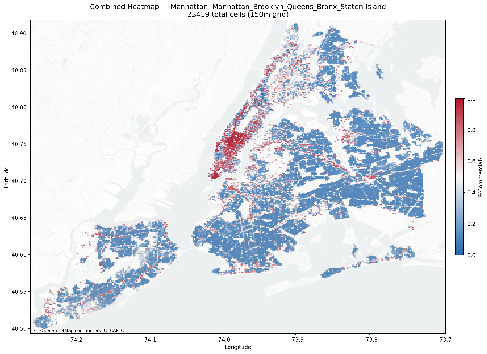

# OSMnx Data Scraper — Urban Zone Classification

Predicts **Commercial vs Residential** zones across NYC boroughs using OpenStreetMap + PLUTO data on a regular 150m grid. Trains Logistic Regression, XGBoost, and Random Forest on 10 features extracted per grid cell. Produces heatmap visualizations and cross-borough comparison analysis.




---

## Setup

**Requirements:** Python 3.11, Windows

```powershell
# 1. Allow script execution (once per session)
Set-ExecutionPolicy -Scope Process -ExecutionPolicy RemoteSigned

# 2. Run setup — creates .venv, installs all dependencies, registers Jupyter kernel
.\setup.ps1
```

> If `.venv` exists but is broken (missing `Scripts/` or `Lib/`), delete it and re-run `setup.ps1`.

---

## Grid Finding Pipeline (recommended)

The main pipeline. Overlays a regular grid on any NYC borough, extracts urban features per cell, and classifies each cell as Commercial or Residential.

### Quick start

1. Open `Grid-Finding/00_orchestrator.ipynb` in VS Code or Jupyter
2. Select kernel: **OSMnx Scraper (Python 3.11)**
3. Edit the parameters in the first code cell
4. **Restart kernel** and **Run All Cells**

First run takes ~5-10 min per borough (Overpass API queries are cached). Subsequent runs ~2-3 min.

### Parameters

All parameters are in the **first code cell** of the orchestrator:

```python
BOROUGH = ["MN"]              # Which boroughs to analyze (see catalog below)
CELL_SIZE_M = 150             # Grid cell size in meters
MIN_LOTS_PER_CELL = 3         # Minimum PLUTO lots per cell (noise filter)
INCLUDE_OTHER = False         # False = binary, True = 3-class (+ Other)
PLUTO_PATH = "../ramy/NYC_pluto_25v4_csv/pluto_25v4.csv"
```

**Borough catalog:**

| Code | Borough | Estimated cells (150m) |
|------|---------|----------------------|
| `"MN"` | Manhattan | ~1,810 |
| `"BK"` | Brooklyn | ~4,500+ |
| `"QN"` | Queens | ~6,000+ |
| `"BX"` | Bronx | ~2,500+ |
| `"SI"` | Staten Island | ~2,000+ |

Run multiple boroughs at once: `BOROUGH = ["MN", "BK", "QN"]`. Each borough runs independently with its own output folder.

### How it works

The orchestrator loops over each borough and runs the full pipeline independently:

```
For each borough:
  01  Grid Definition          generate 150m grid, assign PLUTO lots, derive zone_type (Y)
  02  Amenity Composition      amenity density + food/drink ratio (OSM Overpass)
  03  Building Characteristics avg floors, year built, building count, area (PLUTO)
  04  Land Use Mix             Shannon entropy of landuse distribution (PLUTO)
  05  Tourism Intensity        tourism POI density (OSM Overpass)
  06  Commercial Density       shop density, brand ratio (OSM Overpass)
  ──────────────────────────────────────────────────────────────
  07  ML Classification        train LR, XGBoost, RF → export predictions
  08  Heatmap Visualization    static + interactive maps with basemap

After all boroughs:
  09  Borough Comparison       cross-borough charts, combined map, side-by-side plots
```

### Features (10 columns)

| Feature | Source | Description |
|---------|--------|-------------|
| `amenity_density` | OSM | Amenities per km2 |
| `amenity_ratio_food_drink` | OSM | Proportion of food/drink amenities |
| `shop_density_km2` | OSM | Shops per km2 |
| `brand_ratio` | OSM | Fraction of shops with a brand tag |
| `tourism_density` | OSM | Tourism POIs per km2 |
| `landuse_entropy` | PLUTO | Shannon entropy of landuse categories |
| `avg_floors` | PLUTO | Mean number of floors |
| `avg_yearbuilt` | PLUTO | Mean construction year |
| `building_count` | PLUTO | Number of buildings in cell |
| `total_bldg_area` | PLUTO | Total building area (sqft) |

### Output structure

Each borough gets one folder, overwritten on every run. All `csv/` and `outputs/` are gitignored — regenerate by running the orchestrator.

```
Grid-Finding/
├── csv/                                 (gitignored)
│   ├── Manhattan/
│   │   ├── 01_grid_definition.csv
│   │   ├── 02_amenity_composition.csv
│   │   ├── ...
│   │   ├── combined_grid.csv
│   │   └── 07_predictions.csv
│   └── Brooklyn/
│       └── ...
├── outputs/
│   ├── Manhattan/
│   │   ├── 01_countplot_zone_type.png
│   │   ├── 02_feature_boxplots.png
│   │   ├── 03_correlation_heatmap.png
│   │   ├── 04_confusion_matrix_lr.png
│   │   ├── 05_confusion_matrix_xgb.png
│   │   ├── 06_confusion_matrix_rf.png
│   │   ├── 07_feature_importance_rf.png
│   │   ├── 08_heatmap_predictions.png
│   │   ├── 08_heatmap_interactive.html
│   │   └── 09_summary_dashboard.png
│   ├── Brooklyn/
│   │   └── ...
│   └── Comparison/
│       ├── 01_borough_comparison.png
│       ├── 02_combined_map.png
│       ├── 02_combined_map_interactive.html
│       ├── 03_heatmaps_side_by_side.png
│       ├── 04_dashboards_side_by_side.png
│       ├── 05_feature_comparison.png
│       └── Combined Plots/
│           ├── combined_01_countplot_zone_type.png
│           ├── combined_02_feature_boxplots.png
│           ├── combined_03_correlation_heatmap.png
│           ├── combined_04_confusion_matrix_lr.png
│           ├── combined_05_confusion_matrix_xgb.png
│           ├── combined_06_confusion_matrix_rf.png
│           ├── combined_07_feature_importance_rf.png
│           ├── combined_08_heatmap_predictions.png
│           └── combined_09_summary_dashboard.png
└── cache/                               (Overpass API cache, gitignored)
```

### Classification modes

- **Binary** (`INCLUDE_OTHER = False`): Commercial vs Residential. Heatmap uses a blue-to-red diverging colormap based on P(Commercial).
- **3-class** (`INCLUDE_OTHER = True`): Commercial vs Residential vs Other. Heatmap uses categorical colors (red/blue/green) with confidence-based opacity.

### Data sources

- **PLUTO** (NYC tax-lot data): building characteristics, landuse, zone type labels. Required. Place at `ramy/NYC_pluto_25v4_csv/pluto_25v4.csv`.
- **OpenStreetMap** (via Overpass API): amenities, shops, tourism POIs. Fetched automatically; responses cached in `Grid-Finding/cache/`.

---

## Other Pipelines

### General OSM Scraper (`General-OSM-Scraper/`)

Per-location feature extraction. Loops over neighborhoods in `locations.json`, runs 13 notebooks per location, and merges into a combined CSV. Can also be driven from the **Flask web UI** (`launch_site_scraper.bat` → http://localhost:5000).

### Zone Finding (`Zone-Finding/`)

Predecessor to Grid Finding. Classifies Manhattan census tracts (~310) instead of grid cells. Same features but uses irregular tract boundaries. Grid Finding supersedes this with 7-8x more data points and portability to any borough.

### ML Plot (`ML_Plot/`)

Standalone ML notebook for the General OSM Scraper output. Runs logistic regression and XGBoost on the combined CSV.

---

## Project structure

```
OSMnx-data-scraper/
├── Grid-Finding/               <- main pipeline (recommended)
│   ├── 00_orchestrator.ipynb   <- start here
│   ├── 01-06_*.ipynb           <- feature extraction notebooks
│   ├── 07_ml_classification.ipynb
│   ├── 08_heatmap_visualization.ipynb
│   ├── 09_comparison.ipynb
│   ├── grid.json               <- auto-generated config
│   ├── csv/                    <- per-borough CSVs
│   ├── outputs/                <- per-borough plots
│   └── cache/                  <- Overpass API cache
├── Zone-Finding/               <- census tract pipeline (Manhattan only)
├── General-OSM-Scraper/        <- per-location notebook pipeline
├── Site_Scraper_App/           <- Flask web UI
├── ML_Plot/                    <- standalone ML plots
├── ramy/                       <- PLUTO + pedestrian data (not in repo)
├── setup.ps1                   <- one-time environment setup
├── requirements.txt            <- all Python dependencies
└── launch_site_scraper.bat     <- launches Flask web UI
```
